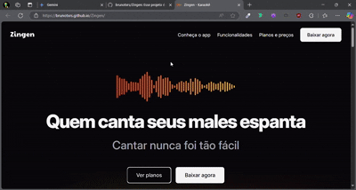

# Zingen Landing Page

Este projeto consiste em uma Landing Page de marketing completa e responsiva para um aplicativo fictício de karaokê chamado Zingen.

## Descrição

A Landing Page foi desenvolvida como parte do currículo da formação Full-stack da <a href="https://app.rocketseat.com.br/">Rocketseat</a>. O objetivo é criar uma página de destino atraente e informativa para promover o aplicativo Zingen, destacando suas principais funcionalidades e incentivando os usuários a baixá-lo.

## Tecnologias Utilizadas
<div align="center">
<a href="https://en.wikipedia.org/wiki/HTML5" target="_blank"></a>
<a href="https://www.w3schools.com/css/" target="_blank"></a>
</div>

* **HTML:** Estrutura da página.
* **CSS:** Estilos e layout da página, incluindo responsividade para diferentes dispositivos.

## Funcionalidades

* **Design Responsivo:** A página se adapta a diferentes tamanhos de tela, proporcionando uma experiência otimizada em desktops, tablets e smartphones.
* **Seções Informativas:** A Landing Page inclui seções que destacam as principais funcionalidades do aplicativo, como a vasta biblioteca de músicas, a interface intuitiva e a experiência de karaokê imersiva.
* **Chamadas para Ação (CTAs):** A página contém botões de download que direcionam os usuários para as lojas de aplicativos (App Store e Play Store).
* **Redes Sociais:** A página inclui links para as redes sociais do aplicativo, permitindo que os usuários se conectem e acompanhem as novidades.
* **Seção de Preços:** A página inclui uma seção de preços, com diferentes planos e funcionalidades.
* **Ilustração:** A página inclui uma ilustração do aplicativo.

## Estrutura do Projeto

O projeto está organizado da seguinte forma:

```
Zingen/
├── src/
│   ├── assets/  
│   │   ├── icons/
│   │   └── outras imagens...
│   ├── favicon/       
│   │   └── favicon.ico
│   └── styles/     
│       └── todos os css do projeto 
├── .gitignore
├── index.html
├── License
└── readme.md 
```

## Como Acessar

  * Acesse a  Zingen Landing Page através deste link:  [Zingen](https://brunotxrs.github.io/Zingen/)

## 📷 Preview
Aqui estão algumas capturas de tela do projeto em diferentes dispositivos:

<p align="center"><strong>Mobile</strong></p>
<p align="center">
  
</p>

<p align="center"><strong>Desktop</strong></p>
<p align="center">
  
</p>

## 🙌 Contribuições

Sinta-se à vontade para abrir issues com sugestões, bugs ou ideias de melhorias! Pull requests também são super bem-vindos! 🤝

## 📜Licença

Este projeto está sob a [licença MIT](./License). Sinta-se à vontade para usar, modificar e compartilhar\! 🚀

## ✨ Developer

👨‍💻 Este projeto foi desenvolvido por <strong>Bruno Teixeira</strong> como parte da formação Full-stack da Rocketseat. Sinta-se à vontade para entrar em contato ou contribuir com o projeto!

- [](https://www.linkedin.com/in/brunotxrs/)

- [](https://github.com/brunotxrs)
